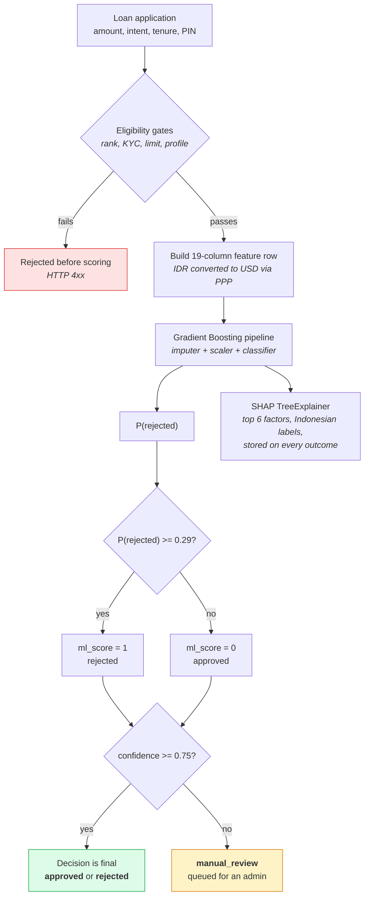
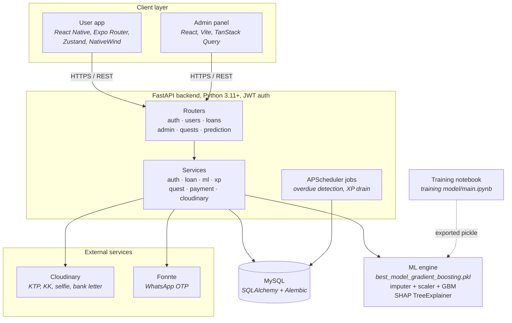
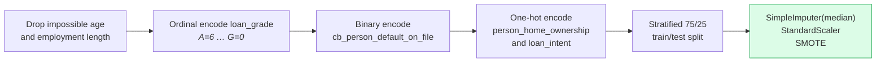

# Cicilin

A machine learning-based loan application platform for the Indonesian market: an Expo mobile app for borrowers, a React admin panel for loan officers, and a FastAPI backend that scores every application with a Gradient Boosting model and explains the decision with SHAP.

The scoring model was chosen after comparing six classifiers under an identical, leakage-free pipeline. Gradient Boosting won with a test ROC-AUC of **0.9488**.

> Course project for Machine Learning (Milestone 4).
> Nicholas Wilson Andrean · Cannavaro Lie · Giovanni August Immanuel Wijaya

---

## Table of contents

- [Why this exists](#why-this-exists)
- [How a loan is decided](#how-a-loan-is-decided)
- [The gamified credit system](#the-gamified-credit-system)
- [System architecture](#system-architecture)
- [Research: model comparison](#research-model-comparison)
- [Repository layout](#repository-layout)
- [Getting started](#getting-started)
- [API reference](#api-reference)
- [Reproducing the training](#reproducing-the-training)
- [User testing](#user-testing)
- [Known limitations](#known-limitations)
- [References](#references)

---

## Why this exists

Indonesian P2P lending (*pinjol*) carries a 4.54% TWP90 default rate, among the fastest-rising in the country's financial sector. The usual responses are repressive rather than preventive: manual credit review that does not scale, debt collectors sent after borrowers who fall behind, and repayment periods extended at higher interest.

Manual review works for a handful of applicants and collapses at thousands, which is why some platforms simply auto-approve. That means no filtering, more borrowers who cannot repay, and more collectors on the payroll.

Cicilin takes the preventive route: score the applicant before approval, so high-risk applications are caught at the gate instead of chased afterwards.

---

## How a loan is decided

Every application runs through the model, and the *confidence* of the prediction decides whether a human ever sees it.



Three details matter here and are easy to miss in the code:

**The rejection threshold is 0.29, not 0.5.** `ML_REJECTION_THRESHOLD` deliberately sits below the default cutoff so that more applicants are flagged as rejected. It was tuned on the test set to trade rejection precision for recall, because the cost of approving a defaulter exceeds the cost of rejecting a good borrower.

**Low confidence routes to a human, not to a guess.** When the winning class probability falls under `ML_CONFIDENCE_THRESHOLD` (0.75), the loan is parked in `manual_review` with `review_status = pending` and surfaced in the admin panel instead of being auto-decided.

**Rupiah are converted before scoring.** The model was trained on a US credit bureau dataset in USD, so `person_income_idr` and `loan_amnt_idr` are divided by `PPP_FACTOR` (4750 IDR per international dollar, World Bank 2024) before they reach the pipeline. Without this the income features would be three orders of magnitude out of distribution.

Every decision also carries a SHAP explanation: per-column SHAP values are aggregated back into logical features (the one-hot `person_home_ownership_*` and `loan_intent_*` columns are summed into single groups), relabelled in Indonesian, and returned as the top six by absolute impact. Positive values push toward approval.

---

## The gamified credit system

Cicilin has no access to a real credit bureau, so it builds its own repayment reputation. Users hold one of seven ranks driven by an XP balance, and the rank sets their borrowing terms and the `loan_grade` fed to the model.

| Rank | Grade | Monthly limit (IDR) | Interest | XP to reach |
|---|---|---|---|---|
| Ruby | A | 100,000,000 | 6% | 2000 |
| Diamond | B | 50,000,000 | 9% | 1500 |
| Platinum | C | 25,000,000 | 12% | 1000 |
| Gold | D | 10,000,000 | 15% | 600 |
| Silver | E | 5,000,000 | 18% | 300 |
| Bronze | F | 2,000,000 | 24% | 100 |
| Iron | G | 0 | n/a | 0 |

Iron rank cannot borrow at all and exists as the floor users fall to after defaulting.

XP moves in both directions. Five monthly quests are drawn at random from a pool of 20 (pay an installment on time, clear every active loan, keep a Gold rank for 30 days) and pay 20 to 300 XP. A background APScheduler job walks overdue repayments daily and applies tiered penalties:

| Days past due | Penalty | Side effect |
|---|---|---|
| 1 to 7 | -40 XP | repayment marked `overdue`, `default_on_file` set to `Y` |
| 8 to 30 | -100 XP | |
| 31+ | -250 XP | treated as a default, credit history flagged |

Users with any overdue repayment also bleed 1 to 3 XP per day depending on rank. Because `cb_person_default_on_file` is one of the model's inputs, a missed payment does not just cost rank, it changes how the model scores the next application.

---

## System architecture



The backend is deployed on Railway and the admin panel on Vercel. The mobile app ships over the air through EAS: a GitHub Actions workflow publishes an OTA update to the `preview` channel on every push touching `frontend/user/`, and warns when native-track files change, since OTA updates carry JS bundles only.

---

## Research: model comparison

### Dataset

32,581 rows from a US credit bureau credit-risk dataset, reduced to 31,679 after cleaning. The target `loan_status` is binary (0 = approved / no default, 1 = rejected / default) and imbalanced at roughly 78% approved to 22% rejected.

| Feature | Description | Type |
|---|---|---|
| `person_age` | Applicant's age | Numeric |
| `person_income` | Annual income | Numeric |
| `person_home_ownership` | Rent, own, mortgage or other | Categorical |
| `person_emp_length` | Years employed | Numeric |
| `loan_intent` | Reason for the loan | Categorical |
| `loan_amnt` | Amount requested | Numeric |
| `loan_int_rate` | Interest rate charged | Numeric |
| `loan_percent_income` | Share of income going to repayments | Numeric |
| `cb_person_default_on_file` | Has previously defaulted | Binary (Y/N) |
| `cb_person_cred_hist_length` | Length of credit history | Numeric |
| `loan_grade` | Reliability score, A (best) to G | Ordinal |
| `loan_status` | Target | Binary (0/1) |

### What the data says

- **Prior default is the strongest single signal.** Applicants with a default on file are rejected about 38% of the time, against about 20% for those without.
- **Loan grade tracks approval cleanly**, dropping monotonically from A through G.
- **Approved loans cluster at low interest rates**, peaking around 7.5%, while most rejections sit at 15% or above.
- **Approved borrowers keep repayments near 10% of income.** A high loan-to-income ratio is the clearest rejection signal.
- **Renters are more likely to be rejected** than owners or mortgage holders.
- **Loan amount alone barely predicts anything.** It is the ratio to income that matters.
- Most numeric features are right-skewed, and `person_age = 120` and `person_emp_length = 120` are impossible values left by data entry.

Ranked by correlation with approval: loan grade, annual income, mortgaged property, owned property and employment length push toward approval; loan-to-income ratio, interest rate, renting and a prior default push toward rejection.

### Preprocessing



The imputer, scaler and SMOTE step live inside an `imblearn` Pipeline, so they are fitted on the training fold only. SMOTE never sees validation or test data, which keeps the cross-validation scores honest.

### Training setup

Six classifiers, each tuned with `GridSearchCV` over Stratified 5-Fold cross-validation, scored on ROC-AUC. The best hyperparameters are then retrained on the full training set and evaluated once on the held-out 25%.

| Model | Search grid |
|---|---|
| Logistic Regression | `C`, `class_weight`, `solver` |
| Support Vector Classifier | `C`, `gamma` |
| Random Forest | `n_estimators`, `max_depth`, `class_weight` |
| Gradient Boosting | `n_estimators`, `max_depth`, `learning_rate` |
| XGBoost | `n_estimators`, `max_depth`, `learning_rate`, `subsample` |
| LightGBM | `n_estimators`, `max_depth`, `learning_rate`, `num_leaves` |

### Results

| Model | CV AUC | Test AUC | Accuracy | Best hyperparameters |
|---|---|---|---|---|
| **Gradient Boosting** ⭐ | **0.9449 ± 0.0026** | **0.9488** | 0.94 | `learning_rate=0.2, max_depth=5, n_estimators=200` |
| LightGBM | 0.9423 ± 0.0017 | 0.9479 | 0.94 | `learning_rate=0.1, max_depth=10, n_estimators=200, num_leaves=63` |
| XGBoost | 0.9398 ± 0.0019 | 0.9442 | 0.94 | `learning_rate=0.1, max_depth=6, n_estimators=200, subsample=1.0` |
| Random Forest | 0.9305 ± 0.0033 | 0.9332 | 0.93 | `class_weight=None, max_depth=20, n_estimators=200` |
| SVC | 0.9023 ± 0.0023 | 0.9059 | 0.88 | `kernel=rbf, C=10` |
| Logistic Regression | 0.8635 ± 0.0024 | 0.8673 | 0.79 | baseline |

Gradient Boosting on the test set (7,920 rows):

| Class | Precision | Recall | F1 | Support |
|---|---|---|---|---|
| Approved (0) | 0.93 | 0.99 | 0.96 | 6,214 |
| Rejected (1) | 0.96 | 0.74 | 0.83 | 1,706 |
| Macro avg | 0.94 | 0.87 | 0.90 | 7,920 |

### Findings

- **Boosting dominates.** The three boosting methods take the top three places, and the spread between them is under 0.005 AUC. Gradient Boosting wins, but LightGBM is close enough that its faster training could justify it.
- **The linear baseline is genuinely worse.** Logistic Regression trails by 0.08 AUC and 15 accuracy points, which is what justifies the extra model complexity rather than shipping the interpretable baseline.
- **Recall on the rejected class is the weak spot.** At 0.74, roughly a quarter of applicants who should be rejected are approved, even with SMOTE. This is why the production threshold was moved to 0.29 rather than left at 0.5.
- **The errors are asymmetric by design.** Gradient Boosting produces 459 false approvals against 59 false rejections on the test set. That asymmetry is exactly what the tuned threshold is meant to pull back.

---

## Repository layout

```
cicilin/
├── backend/
│   ├── app/
│   │   ├── main.py            FastAPI app, lifespan, CORS, router mounting
│   │   ├── routers/           auth, users, loans, admin, quests, prediction
│   │   ├── services/          auth, loan, ml, xp, quest, payment, cloudinary, admin
│   │   ├── models/            SQLAlchemy ORM: users, loans, repayments, KYC, XP
│   │   ├── schemas/           Pydantic request and response models
│   │   ├── jobs/scheduler.py  APScheduler: overdue detection, XP drain
│   │   ├── core/              settings, database, security, rank constants
│   │   └── ml/                best_model_gradient_boosting.pkl
│   ├── migrations/            Alembic
│   └── seed_admin.py          creates the first admin account
├── frontend/
│   ├── user/                  Expo React Native app
│   │   ├── app/               expo-router: (auth), (onboarding), (tabs), profile
│   │   ├── components/        UI kit, rank badges, loan sheets
│   │   ├── services/          API clients
│   │   └── store/             Zustand stores
│   └── admin/                 React + Vite admin panel
│       └── src/pages/         Dashboard, KYCReview, LoanReview, Users, DevGodMode
├── training model/
│   ├── main.ipynb             EDA, preprocessing, GridSearchCV over 6 models
│   └── data description.txt
└── .github/workflows/         EAS OTA publish for the user app
```

---

## Getting started

### Prerequisites

- Python 3.11+
- Node.js 20+
- MySQL (the project is set up against Laragon locally)
- Cloudinary account for KYC document storage
- Fonnte account for WhatsApp OTP, optional in development

### Backend

```bash
cd backend
python -m venv venv
venv\Scripts\activate          # Windows
pip install -r requirements.txt
```

Copy `.env.example` to `.env` and fill it in:

```env
APP_ENV=development
SECRET_KEY=            # openssl rand -hex 32
DATABASE_URL=mysql+pymysql://root@127.0.0.1:3306/cicilin

MODEL_PATH=app/ml/best_model_gradient_boosting.pkl
ML_CONFIDENCE_THRESHOLD=0.75
ML_REJECTION_THRESHOLD=0.29
PPP_FACTOR=4750

CLOUDINARY_CLOUD_NAME=
CLOUDINARY_API_KEY=
CLOUDINARY_API_SECRET=

FONNTE_API_KEY=        # leave empty in development: OTP prints to the console
```

Create the schema and the first admin, then run:

```bash
alembic upgrade head
python seed_admin.py
uvicorn app.main:app --reload --port 8000
```

Interactive API docs are at `http://127.0.0.1:8000/docs`, and `GET /health` reports database connectivity.

`seed_admin.py` creates `admin@cicilin.id` with a hardcoded password. Change it before any deployment that is reachable from the internet.

### Mobile app

```bash
cd frontend/user
npm install
npx expo start
```

The API base URL comes from `EXPO_PUBLIC_API_URL` and falls back to the deployed Railway backend. Point it at your machine's LAN address to develop against a local backend; `127.0.0.1` will not resolve from a physical device.

### Admin panel

```bash
cd frontend/admin
npm install
npm run dev
```

The base URL is currently hardcoded in `src/services/api.ts`. Change it there to target a local backend.

---

## API reference

All user endpoints except `/auth/*` require `Authorization: Bearer <access_token>`. Admin endpoints require an admin token from `/admin/auth/login`.

### Auth

| Method | Path | Purpose |
|---|---|---|
| POST | `/auth/register` | Register with a phone number, triggers an OTP |
| POST | `/auth/verify-otp` | Verify the OTP, returns access and refresh tokens |
| POST | `/auth/login` | Log in with phone and password |
| POST | `/auth/refresh` | Exchange a refresh token |
| POST | `/auth/resend-otp` | Resend the OTP |
| POST | `/auth/forgot-password` · `/auth/reset-password` | Password recovery |

### Users and KYC

| Method | Path | Purpose |
|---|---|---|
| GET / PUT | `/users/me` | Read or update the profile |
| POST / PUT | `/users/me/set-pin` · `/users/me/change-pin` | Manage the 6-digit transaction PIN |
| GET | `/users/me/rank` | Current rank, XP and progress to the next tier |
| GET | `/users/kyc/status` | KYC review state |
| POST | `/users/kyc/upload-ktp` · `upload-kk` · `upload-selfie` · `upload-bank-letter` | Upload documents to Cloudinary |
| GET / PUT | `/users/employment` | Employment details, required before applying |
| POST / GET | `/users/bank-account` · `/users/bank-accounts` | Disbursement accounts |

### Loans

| Method | Path | Purpose |
|---|---|---|
| POST | `/loans/apply` | Apply, score and decide in one call |
| GET | `/loans/` | List the user's loans, filterable by tab |
| GET | `/loans/{loan_id}` | Loan detail including the SHAP explanation |
| POST | `/loans/{loan_id}/accept-offer` | Accept an approved offer, disburses and builds the schedule |
| GET | `/loans/{loan_id}/repayments` | Installment schedule |
| POST | `/loans/{loan_id}/repayments/{repayment_id}/pay` | Pay an installment (simulated, no gateway) |

`POST /loans/apply` body:

| Field | Type | Constraints |
|---|---|---|
| `loan_amnt` | float | minimum 500,000 IDR, capped by the rank's monthly limit |
| `loan_intent` | string | `PERSONAL`, `EDUCATION`, `MEDICAL`, `VENTURE`, `HOMEIMPROVEMENT`, `DEBTCONSOLIDATION` |
| `tenure_months` | int | 3, 6, 12 or 24 |
| `pin` | string | exactly 6 digits |

Grade and interest rate are not client-supplied; they are derived from the user's rank at application time. A loan moves through `pending` → `scoring` → `approved` / `rejected` / `manual_review`, then `disbursed` and finally `closed`.

### Prediction

`POST /prediction/score` runs the model directly, without creating a loan or touching the database. Useful for testing the scorer in isolation.

Body: `person_age`, `person_income_idr`, `person_emp_length`, `person_home_ownership`, `loan_grade`, `loan_amnt_idr`, `loan_int_rate`, `loan_percent_income`, `cb_person_default_on_file`, `cb_person_cred_hist_length`, `loan_intent`.

```json
{
  "loan_status": 0,
  "confidence": 0.9812,
  "decision": "approved"
}
```

`decision` is `approved`, `rejected`, or `manual_review` when confidence falls below the threshold.

### Admin

| Method | Path | Purpose |
|---|---|---|
| POST | `/admin/auth/login` | Admin login |
| GET | `/admin/kyc/pending` | KYC queue |
| PUT | `/admin/kyc/{kyc_id}/review` | Approve or reject a KYC submission |
| GET | `/admin/loans/pending` | Loans held for manual review |
| PUT | `/admin/loans/{loan_id}/review` | Override the model's decision |
| GET | `/admin/users` | Paginated user list |
| GET / PATCH | `/admin/dev/users/{user_id}` | Developer overrides, used by the DevGodMode page |
| POST | `/admin/dev/users/{user_id}/reset-monthly-limit` | Reset a user's monthly borrowing limit |

### Quests

| Method | Path | Purpose |
|---|---|---|
| GET | `/quests/active` | The five quests drawn for the current month and their progress |

---

## Reproducing the training

1. Place the credit risk dataset as `credit_risk_dataset.csv` next to `training model/main.ipynb`. The CSV is gitignored and not committed.
2. Run the notebook top to bottom. It performs EDA, applies the preprocessing above, builds the `imblearn` pipeline, runs `GridSearchCV` over all six models, and reports classification metrics, confusion matrices and ROC curves.
3. The best estimator is pickled. Copy it to `backend/app/ml/best_model_gradient_boosting.pkl` to deploy it.

The pickle is a full pipeline, not a bare classifier. `MLService` unwraps `named_steps` to pull out the imputer and scaler so SHAP can be run against the same transformed feature space the classifier was trained on. If you export a bare estimator instead, the SHAP explanation will silently be computed on the wrong scale.

---

## User testing

Five participants: one bank employee, two accounting undergraduates, one nutrition science student and one computer science student. Each was given a scenario (Rp 20,000,000 medical loan, 3-month tenure, 12% interest, Rp 144,000,000 annual income, 10 years employed), asked to predict the outcome, then shown the app's decision.

Ease of use scored 4 to 5 out of 5, and response speed likewise. Clarity of the approve/reject explanation scored 3 to 5. Trust in the prediction was the weakest dimension and the most spread, ranging across the whole 1 to 5 scale.

The substantive criticism came from the two finance-literate participants, and both landed on the same point: the model penalises applicants whose income is large relative to the loan, which is backwards. As the banker put it, high earners often borrow precisely because their wealth is illiquid, so a small loan against a large income signals liquidity management rather than risk. The accounting student independently flagged the same behaviour, plus the housing category treating renting as a negative when it need not be. Requested features were integration with external data to sharpen the loan-intent signal, late-payment warnings, and clearer highlighting of the key numbers.

---

## Known limitations

- **The dataset is American, the users are Indonesian.** Around 32,000 rows from a US credit bureau, bridged to IDR by a single PPP constant. Credit-risk models in industry train on millions of records spanning years, and this one must be re-validated on real Indonesian loan data before it could be deployed for real money.
- **Only 78:22 balance, and SMOTE is synthetic.** Oversampling the minority class generates plausible but invented high-risk borrowers, which is not the same as observing them. Rejected-class recall of 0.74 is the visible cost.
- **The model is static.** It is trained once, pickled and shipped. There is no retraining schedule, no drift detection and no feedback loop from actual repayment outcomes back into the model.
- **Eleven input features is thin** for a credit decision, and the decision threshold is a fixed constant rather than a policy that adapts to portfolio performance.
- **No regulatory integration.** A real Indonesian lender needs SLIK OJK credit bureau checks and OJK compliance hooks. Neither exists here.
- **Payments are simulated.** There is no payment gateway; `payment_service` marks repayments as paid. There is also no amortised interest model, no push notifications and no loan calculator.
- **Manual review does not scale.** It is the fallback for every low-confidence application, which is the same bottleneck the project set out to remove, just pushed to a smaller slice of traffic.
- **The leaderboard router is not mounted.** `app/routers/leaderboard.py` exists but is never included in `main.py`, so the mobile app's leaderboard tab has no backend behind it.
- **Admin CORS is fully open.** `allow_origins=["*"]` with `allow_credentials=True` is a development convenience that should not survive to production.

---

## References

- Advancing credit risk modelling with Machine Learning (2024). *Engineering Applications of AI*, Scopus Q1.
- Machine Learning and Metaheuristics for Credit Risk (2025). PubMed Central.
- Ensemble Credit Scoring with Logistic Regression (2023). *Expert Systems with Applications*.
- Predicting Bank Loan Approval with Logistic Regression (2024). President University ICFBE.
- Bibliometric Analysis of Credit Risk (2023). Web of Science, SCIRP.
- Financial Default Prediction with Logistic Regression and SMOTE (2022). Hindawi, PMC9552691.
